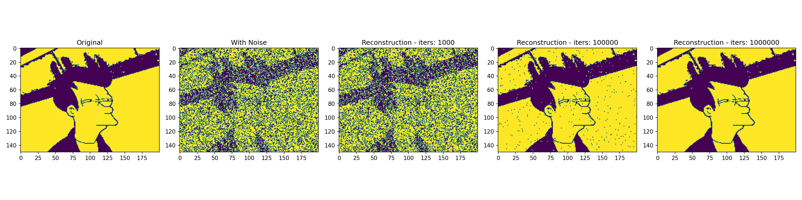

# hopfield
Basic implementation of a Hopfield Network.

The example below shows the network reconstructing a masked and noised version of the original image.

### Noisy reconstruction

### Masked Reconstruction
